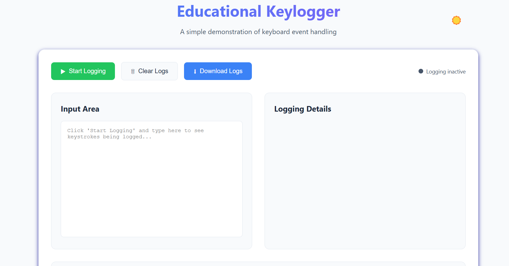

# WebKeyLogger

This project is a **browser-based keylogger demonstration** built with JavaScript. It captures keyboard inputs in real-time and logs them within the browser interface for **educational purposes only**.

## 🚀 Live Demo  
🔗 [Key Logger Demonstration](https://azeezafarhanashaik.github.io/key-logger-demonstration/)

## 📌 Features  
- Start and stop keystroke logging.  
- Clear logged keystrokes.  
- Download logged keystrokes as a file.  
- Informational guide on **how keyloggers work** and **how to protect yourself** from malicious keyloggers.

## ⚠️ Disclaimer  
This project is intended **only for educational purposes** to demonstrate JavaScript keyboard event handling.  
- ❌ It does **not** store, transmit, or misuse logged keystrokes.  
- ❌ It is **not** meant for unethical hacking or malicious activities.  
- ✅ Use it **responsibly and ethically** for learning.

## 🛠️ Technologies Used  
- **HTML** - Structure of the webpage  
- **CSS** - Styling for a clean UI  
- **JavaScript** - Handling keyboard events and logging keystrokes  

## 🛡️ How to Protect Yourself from Keyloggers  
- Use **anti-malware software** that detects keyloggers.  
- Avoid installing software from **untrusted sources**.  
- Keep your **operating system and applications updated**.  
- Enable **two-factor authentication (2FA)**.  
- Use **password managers** to auto-fill credentials securely.  
- Utilize **virtual keyboards** for sensitive input.

## 📷 Screenshots  
### Key Logger Interface  
  

### Keylogger Information & Protection Guide  
  

---

🔗 **Created by [Azeeza Farhana](https://github.com/azeezafarhanashaik)**  
